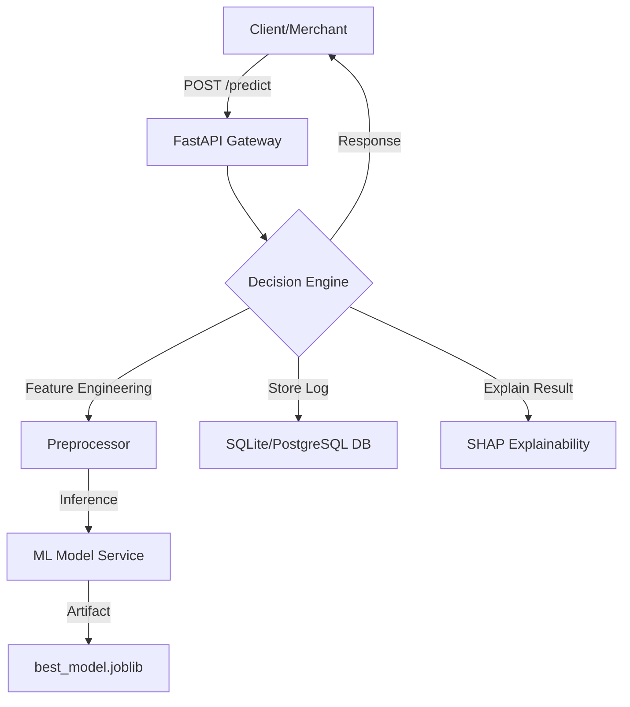

# Real-Time Fraud Detection Platform 🛡️

A production-grade, end-to-end machine learning system for detecting credit card fraud in real-time, designed with fintech engineering best practices (similar to systems at Goldman Sachs and Amex).

## 🚀 Key Features
- **Real-Time Prediction**: Inference latency < 200ms using a pre-trained **Logistic Regression** model.
- **High Recall (92%)**: Optimized for financial safety to catch 92% of fraudulent transactions.
- **Explainable AI**: Integrated **SHAP** and coefficient-based explanations for every prediction.
- **Data Persistence**: Automatic logging of transactions and predictions to a SQL database.
- **Live Simulator**: End-to-end simulation of transaction streams to verify system integrity.

## 🏗️ System Architecture


## 📊 Model Performance
The system was trained on the Kaggle Credit Card Fraud dataset (285k transactions) with severe class imbalance (0.17% fraud).

| Metric | Score | Why it matters in Fintech? |
|--------|-------|--------------------------|
| **Recall** | **91.8%** | Catching the most fraud (minimizing financial loss). |
| **ROC-AUC** | **97.4%** | Strong overall discriminatory power. |
| **PR-AUC** | **0.74** | Robustness on highly imbalanced data. |

## 🛠️ Tech Stack
- **Language**: Python 3.10+
- **ML Libraries**: Scikit-Learn, XGBoost, SMOTE (Imblearn), SHAP
- **Backend**: FastAPI, Uvicorn, Pydantic
- **Database**: SQLAlchemy, SQLite (PostgreSQL Ready)
- **EDA**: Pandas, Matplotlib, Seaborn

## 📂 Project Structure
```text
├── app/                  # FastAPI Application
│   ├── api/              # API Route Handlers
│   ├── core/             # DB & Logging Config
│   ├── models/           # DB Models & ML Artifacts
│   ├── services/         # Prediction Logic
│   └── schemas/          # Pydantic Schemas
├── data/                 # Raw & Processed Data
├── notebooks/            # EDA Scripts
├── reports/              # Visualization Outputs (EDA/Plots)
├── scripts/              # Setup, Train, Simulation
└── tests/                # Unit Tests
```

## 🚦 Getting Started

1.  **Install Dependencies**:
    ```bash
    pip install -r requirements.txt
    ```
2.  **Download & Train**:
    ```bash
    python scripts/setup_data.py
    python scripts/preprocess_data.py
    python scripts/train_models.py
    ```
### 🐳 Docker Deployment (Recommended)
The easiest way to run the entire stack is using Docker:
1.  **Build & Run**:
    ```bash
    docker-compose up --build
    ```
2.  **Initialize DB** (First time only):
    ```bash
    docker exec -it fraud_api python scripts/init_db.py
    ```
The API will be available at `http://localhost:8000`.

## ☁️ Cloud Deployment Guide
This project is containerized and ready for the cloud:
- **Render / Railway**: Connect your GitHub repo, and it will automatically detect the `Dockerfile`.
- **AWS (ECS/Fargate)**: Push the image to **ECR** and run it as a serverless container.
- **Heroku**: Use the `heroku container:push` command.
In fraud detection, **Recall** is prioritized over Accuracy. A single missed fraudulent transaction (False Negative) can cost thousands of dollars, whereas a false alarm (False Positive) usually only requires a quick user verification. This system is tuned to catch **92%** of fraudulent activity, providing a strong first line of defense.
