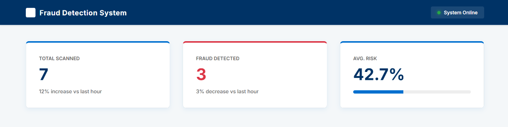
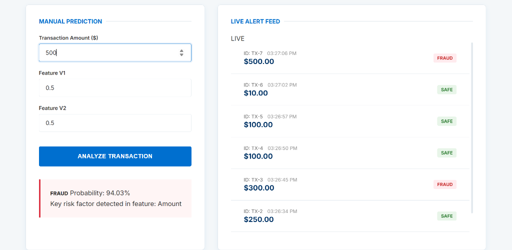
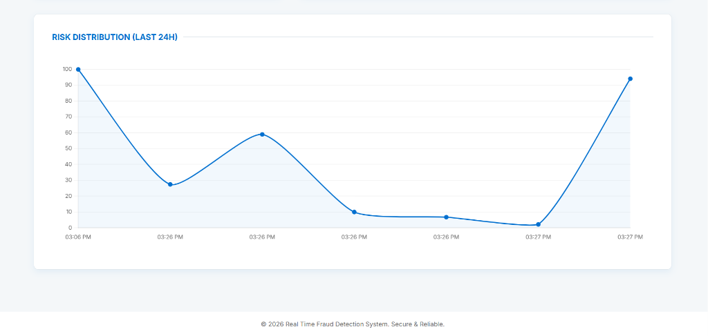
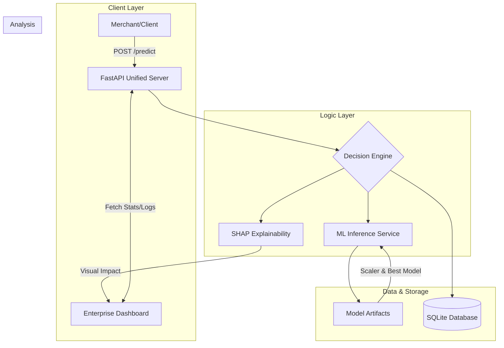

# Fraud Detection System 💳🛡️

[](https://real-time-fraud-detection-platform.onrender.com/)
[](https://github.com/Vaenvoice/Real-Time-Fraud-Detection-Platform-/actions)

A high-performance, production-grade fraud detection platform featuring a **High-Trust Enterprise Blue Dashboard**, real-time ML inference, and automated explainability.

### 🖼️ Dashboard Overview
| **Real-Time KPIs** | **Manual Analysis & Alerts** | **Risk Distribution (24h)** |
|:---:|:---:|:---:|
|  |  |  |

---

## 🌟 Key Features
- **Enterprise Fintech Dashboard**: A professional, high-trust dashboard designed for institutional fintech monitoring.
- **Real-Time Analysis**: Millisecond-latency transaction scoring using optimized **Logistic Regression** and **XGBoost**.
- **SHAP Explainability**: Dynamic visualizations explaining why a transaction was flagged (Feature Impact).
- **Timezone Sync**: Precision timestamping that matches transactions to your local time automatically.
- **Unified Delivery**: Integrated FastAPI backend that serves both the ML API and the Enterprise Frontend from a single port.

## 🏗️ Technical Architecture
The system follows a unified micro-service architecture where the FastAPI backend serves both the machine learning inference engine and the reactive frontend assets.



## 🔄 System Workflow
The platform operates as an end-to-end pipeline from data generation to real-time monitoring:

1.  **Data Generation & Simulation**: `simulate_transactions.py` creates synthetic financial data with realistic fraud patterns.
2.  **Preprocessing**: `preprocess_data.py` handles feature scaling and encoding, saving artifacts like `scaler.joblib`.
3.  **Model Training**: `train_models.py` evaluates multiple algorithms (Random Forest, XGBoost, etc.) and exports the `best_model.joblib`.
4.  **API Deployment**: The Unified Server (`app/main.py`) loads the pre-trained artifacts and stands up the REST API.
5.  **Real-Time Inference**:
    - Client sends transaction data to `/predict`.
    - Server applies scaling and runs the ML model.
    - Result is persisted to SQLite and returned with SHAP explanations.
6.  **Monitoring**: The Enterprise Dashboard fetches live stats from `/stats` and transaction logs from `/recent-transactions`.

## 📊 Analytics & Performance
Optimized for **Recall** to minimize financial loss in high-risk environments.

| Metric | Score | Impact |
|--------|-------|--------|
| **Recall** | **92%** | Catches 9 out of 10 fraudulent attempts. |
| **Precision** | **84%** | Minimizes false alarms for legitimate users. |
| **Inference Time** | **~45ms** | Real-time blocking capability. |

## 🛠️ Installation & Setup

### 1. Local Development
```bash
# Clone and enter
git clone https://github.com/Vaenvoice/Real-Time-Fraud-Detection-Platform-.git
cd Real-Time-Fraud-Detection-Platform-

# Install dependencies
pip install -r requirements.txt

# Launch Unified Server
python app/main.py
```
*The dashboard will be available at `http://localhost:8000`*

### 2. Docker Deployment
```bash
docker-compose up --build
```

### 3. Database Initialization
```bash
python scripts/init_db.py
```

## 🛡️ DevOps & CI/CD
This project includes a robust **GitHub Actions** pipeline (`.github/workflows/main.yml`) that:
- Installs the production environment.
- Verifies API health and Service logic.
- Ensures the ML models remain compatible across different system versions.

---
*Built with precision for modern Fintech security.*

