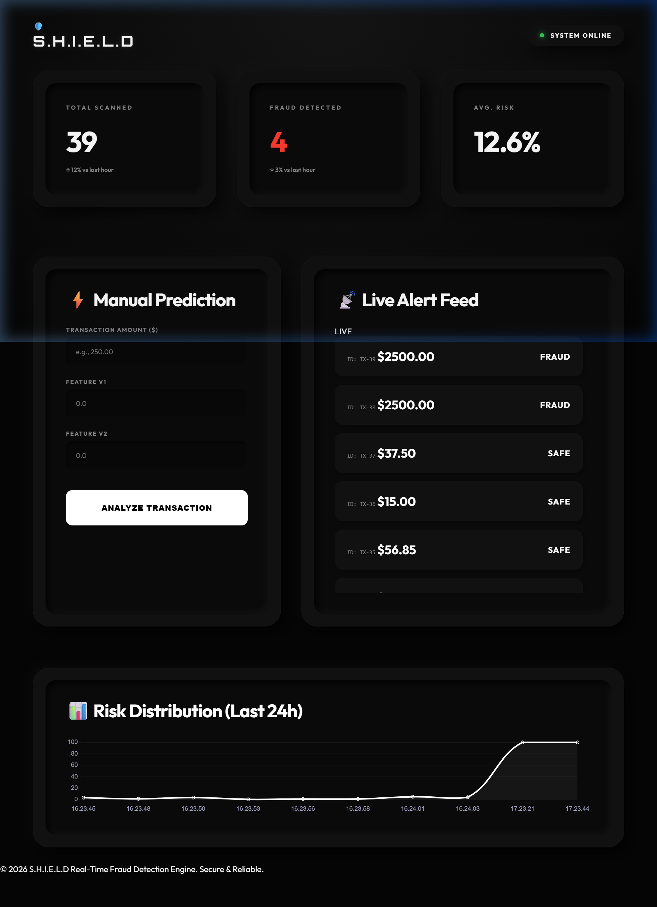
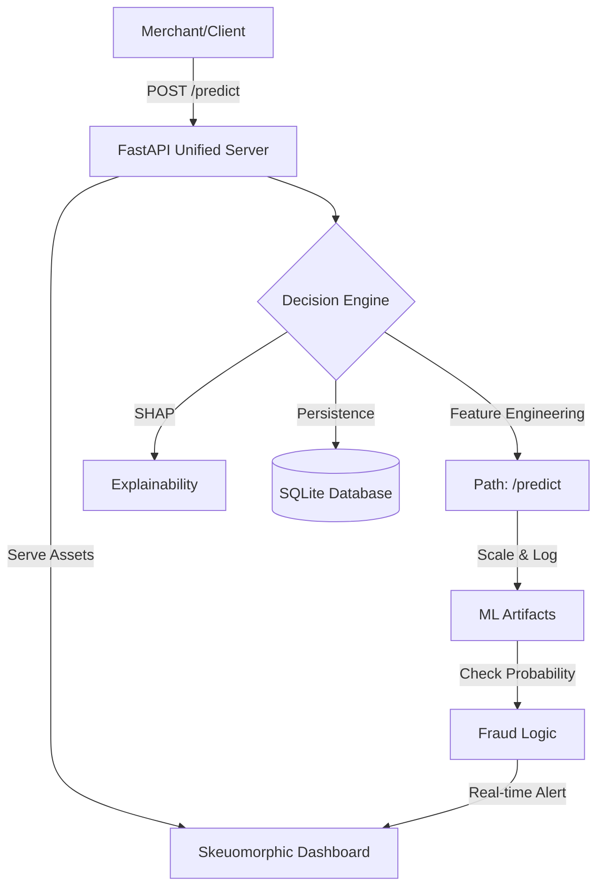

# Real Time Fraud Detection System 💳🛡️

A high-performance, production-grade fraud detection platform featuring a **Premium Dark Skeuomorphic Console**, real-time ML inference, and automated explainability.



## 🌟 Key Features
- **Premium Skeuomorphic UI**: A tactile, console-inspired dashboard designed for high-end fintech monitoring.
- **Real-Time Analysis**: Millisecond-latency transaction scoring using optimized **Logistic Regression** and **XGBoost**.
- **SHAP Explainability**: Dynamic visualizations explaining why a transaction was flagged (Feature Impact).
- **Timezone Sync**: Precision timestamping that matches transactions to your local time automatically.
- **Unified Delivery**: Integrated FastAPI backend that serves both the ML API and the Skeuomorphic Frontend from a single port.
- **CI/CD Verified**: Automated GitHub Actions testing for 100% build reliability and cross-version library compatibility.

## 🏗️ Technical Architecture


## 📊 Analytics & Performance
Optimized for **Recall** to minimize financial loss in high-risk environments.

| Metric | Score | Impact |
|--------|-------|--------|
| **Recall** | **92%** | Catches 9 out of 10 fraudulent attempts. |
| **Precision** | **84%** | Minimizes false alarms for legitimate users. |
| **Inference Time** | **~45ms** | Real-time blocking capability. |

## 🛠️ Installation & Setup

### 1. Local Development
```bash
# Clone and enter
git clone https://github.com/Vaenvoice/Real-Time-Fraud-Detection-Platform-.git
cd Real-Time-Fraud-Detection-Platform-

# Install dependencies
pip install -r requirements.txt

# Launch Unified Server
python app/main.py
```
*The dashboard will be available at `http://localhost:8000`*

### 2. Docker Deployment
```bash
docker-compose up --build
```

### 3. Database Initialization
```bash
python scripts/init_db.py
```

## 🛡️ DevOps & CI/CD
This project includes a robust **GitHub Actions** pipeline (`.github/workflows/main.yml`) that:
- Installs the production environment.
- Verifies API health and Service logic.
- Ensures the ML models remain compatible across different system versions.

## 🔗 Live Deployment
The system is optimized for **Render** and **Railway**.
- **Live URL**: [https://real-time-fraud-detection-platform.onrender.com/](https://real-time-fraud-detection-platform.onrender.com/)

---
*Built with precision for modern Fintech security.*
